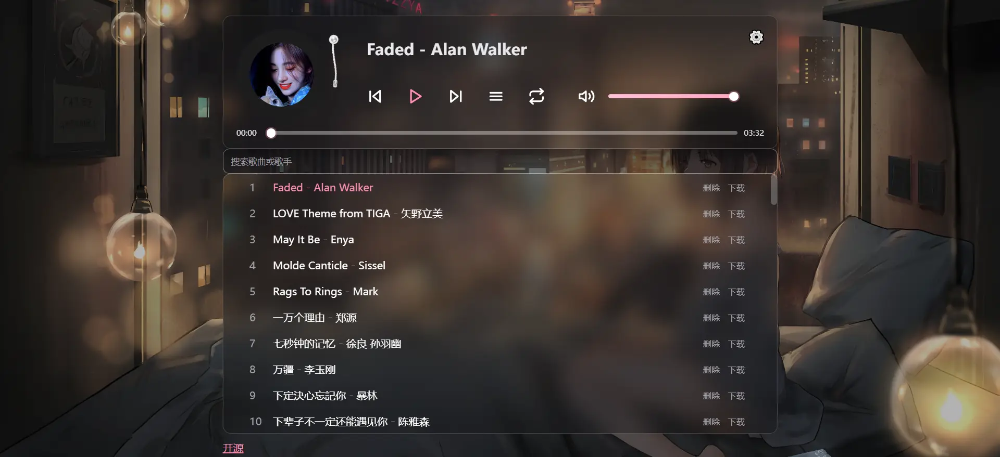

# 🎵 Music Player

## 一个筒约音乐播放器，支持在线播放，歌单管理等功能，采用 React + Vite 构建，支持多平台部署

<p align="center">
  
</p>

  <a href="https://reactjs.org/">
    
  </a>
  <a href="https://vitejs.dev/">
    
  </a>
  <a href="https://www.javascript.com/">
    
  </a>
  <a href="https://pages.cloudflare.com/">
    
  </a>
  <a href="https://vercel.com/">
    
  </a>
  <a href="https://pages.edgeone.ai/">
    
  </a>
  <a href="https://hub.docker.com/r/zxlwq/music">
    
  </a>
</p>




---


### 技术栈

- **前端框架** - React
- **构建工具** - Vite
- **样式** - 原生 CSS


### 🎶 核心功能
- **在线音乐播放** - 支持多种音频格式
- **歌单管理** - 添加、删除、搜索歌曲
- **MV 播放** - 支持为歌曲添加MV链接
- **歌单导入** - 支持从GitHub仓库API导入歌单
- **美化设置** - 自定义字体、背景图片
- **响应式设计** - 完美适配移动端和桌面端


---


## 🚀 多平台部署教程

### 🌐 Cloudflare Pages 部署
   - Fork该项目
   - 访问 [Cloudflare Pages](https://pages.cloudflare.com/)
   - 连接 GitHub 仓库
   - 选择框架：React (Vite)
   - 添加环境变量
   - 部署完成添加自定义名


### ⚡ EdgeOne Pages 部署

   - Fork该项目
   - 访问 [EdgeOne Pages](https://pages.edgeone.ai/)
   - 连接 GitHub 仓库
   - 添加环境变量
   - 部署完成添加自定义名


### 🚀 Vercel 部署

   - Fork该项目
   - 访问 [Vercel](https://vercel.com/)
   - 连接 GitHub 仓库
   - 添加环境变量
   - 部署完成添加自定义名


### 🎯 Hugging Face Spaces部署

#### 使用 music-api.yml 创建 Spaces

1. **创建Token（需要写权限）**

2. **运行GitHub Actions**

3. **自动创建 Spaces**
   - 脚本会自动创建 Hugging Face Spaces
   - 设置所有必要的环境变量


### 🐳 Docker 部署

#### 使用该镜像或者自己构建镜像

```bash
zxlwq/music:latest
```

```bash
ghcr.io/zxlwq/music:latest
```

### Docker Compose

创建 `docker-compose.yml` 文件：

```yaml
version: '3.8'
services:
  music:
    build: .
    ports:
      - "3000:3000"
    environment:
      - NODE_ENV=production
      - GIT_REPO=${GIT_REPO}
      - GIT_TOKEN=${GIT_TOKEN}
      - GIT_BRANCH=${GIT_BRANCH:-main}
      - PASSWORD=${PASSWORD}
      - GIT_URL=${GIT_URL}
      - WEBDAV_URL=${WEBDAV_URL}
      - WEBDAV_USER=${WEBDAV_USER}
      - WEBDAV_PASS=${WEBDAV_PASS}
    volumes:
      - ./public/music:/app/public/music
      - ./public/covers:/app/public/covers
      - ./public/images:/app/public/images
    restart: unless-stopped
    container_name: music
```


---


## 🔧 环境变量说明

| 变量名 | 需否 | 说明 | 示例 |
|--------|------|------|------|
| `GIT_REPO` | ✅ | GitHub 仓库名 | `zxlwq/music` |
| `GIT_TOKEN` | ✅ | GitHub Token | `ghp_xxxxxxxxxxxx` |
| `GIT_BRANCH` | ❌ | Git 分支（默认：main） | `main` |
| `PASSWORD` | ✅ | 管理员密码 | `password` |
| `GIT_URL` | ❌ | 代理服务 | `https://proxy.com` |
| `WEBDAV_URL` | ❌ | WebDAV 地址 | `https://dav.example.com` |
| `WEBDAV_USER` | ❌ | WebDAV 用户名 | `username` |
| `WEBDAV_PASS` | ❌ | WebDAV 密码 | `password` |

 - 将 `env.example `重名为 `.env`

## 🎵 使用指南

### 添加音乐

1. 点击右上角设置按钮
2. 填写歌曲信息：
   - 音频文件 URL
   - 歌名 - 歌手
   - MV 链接（可选）
3. 点击"添加歌曲"按钮

### 删除音乐

输入 `PASSWORD `管理员密码


### 导入歌单

1. 选择导入方式：
   - **GitHub 仓库** - 从 GitHub 仓库导入
   - **API 接口** - 从[Player项目](https://github.com/zxlwq/Player) API歌单导入


### 美化设置

1. 自定义选项：
   - **字体设置** - 选择喜欢的字体
   - **背景图片** - 设置自定义背景

## 添加新唱片封面后，需要更新以下两个文件中的封面列表：

   **修改 `src/App.jsx`**：
   ```javascript
   // 更新 localPreferred 数组
   const localPreferred = ['a.webp','b.webp','c.webp','d.webp','e.webp','f.webp','g.webp','h.webp','i.webp','j.webp','k.webp','l.webp','m.webp','n.webp','o.webp','p.webp','q.webp','r.webp','s.webp','t.webp','u.webp','v.webp','w.webp','x.webp','y.webp','z.webp']
   ```

   **修改 `scripts/generate.mjs`**：
   ```javascript
   // 更新 preferredOrder 数组
   const preferredOrder = [
     'a.webp','b.webp','c.webp','d.webp','e.webp','f.webp','g.webp','h.webp','i.webp','j.webp','k.webp','l.webp','m.webp','n.webp','o.webp','p.webp','q.webp','r.webp','s.webp','t.webp','u.webp','v.webp','w.webp','x.webp','y.webp','z.webp'
   ]
   ```


---


## 📄 许可证

本项目基于 MIT 许可证开源 - 查看 [LICENSE](LICENSE) 文件了解详情。


⭐ 如果这个项目对您有帮助，请给一个星标！
